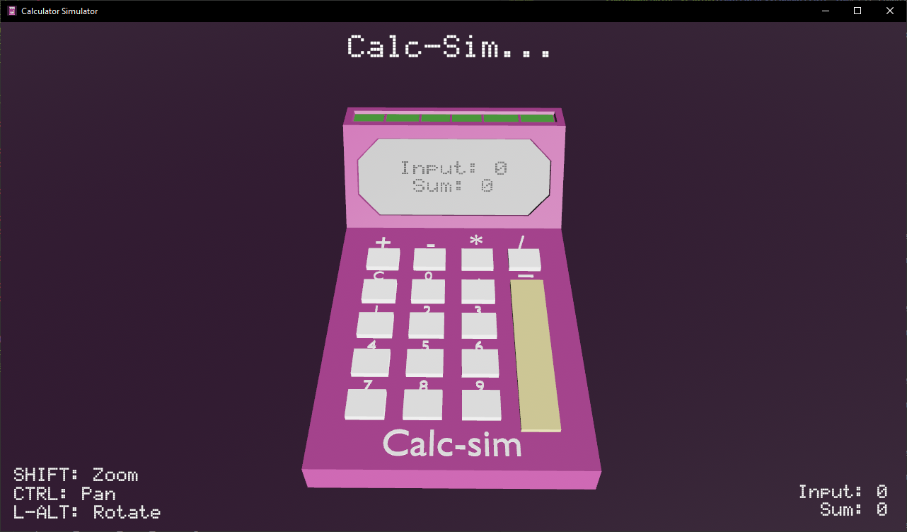

# Calculator Simulator

This project is my personal learning space for building a functional Bevy app. It is a work-in-progress where I experiment.



## Features

- Bevy-based 3D interface.
- Interactive calculator buttons.
- Sound, UI, and Animations built with Bevy's ECS (Entity Component System).

### Running the Project

To run the project locally, clone the repository and use `cargo run`:

```sh
git clone https://github.com/yourusername/calc_sim.git
cd calc_sim
cargo run
```

### Download Pre-Baked Portable Windows Copy

If you just want to try the app without building it, you can download a precompiled version:

[Download Portable Version](./versions/CalcSim_V0_1_portable.zip)